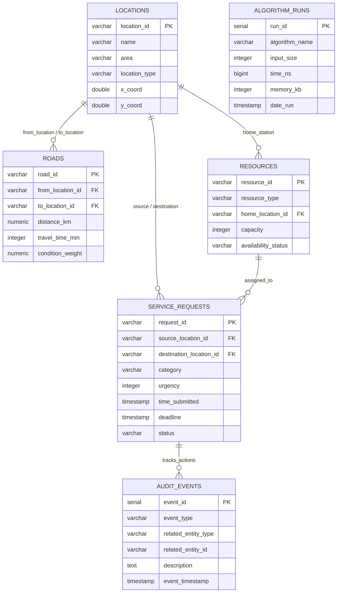

# ECG Dumsor Response Optimizer — Data Dictionary
## Group 15 — Codebility v2.0 | DCIT 204 & DCIT 308 Joint Project
**System:** Electricity Company of Ghana (ECG) Outage Response & Repair Optimizer  
**Database Target:** PostgreSQL (Neon.tech) with offline CSV persistence fallback  
**Local Context:** Accra / Legon Power Distribution Network

---

## 1. System Architecture & Entity Relationship Model

The ECG Dumsor Response Optimizer maintains relational state across six primary database entities and CSV files. In-memory custom data structures (Graphs, Hash Tables, Priority Queues, Balanced Trees, Disjoint Sets, and Stacks) directly interface with these entities.

---

## 2. Detailed Data Dictionary Tables

### 2.1 `locations` Table (`data/locations.csv`)
* **Description:** Represents geographic electrical nodes across the Accra/Legon power distribution grid, including primary substations, switching stations, distribution transformers, customer service centers, and campus facilities.
* **DSA Mapping:** Graph Vertices ($V = 50$), indexed by `HashTable` and `CustomMap` for $O(1)$ ID-to-Vertex translation.

| Column Name | SQL Data Type | Java Type | Nullable | Primary / Foreign Key | Constraints / Allowed Values | Description & Ghana Context | Sample Value |
|---|---|---|:---:|:---:|---|---|---|
| `location_id` / `id` | `VARCHAR(10)` / `INT` | `String` / `int` | **No** | **Primary Key** | Non-empty, unique alphanumeric ID | Unique identifier for the substation or grid node | `0` or `L001` |
| `name` | `VARCHAR(150)` | `String` | **No** | — | Unique, max 150 chars | Formal name of the ECG substation, facility, or landmark | `Legon Main Gate Substation` |
| `area` | `VARCHAR(100)` | `String` | **No** | — | Legon, East Legon, Madina, Adenta, Haatso, Achimota | Operational distribution zone or district in Greater Accra | `Legon` |
| `location_type` | `VARCHAR(50)` | `String` | **No** | — | `Substation`, `Feeder Hub`, `Campus zone`, `Customer Center` | Functional classification of the electrical infrastructure | `Campus zone` |
| `x_coord` | `DOUBLE PRECISION` | `double` | **No** | — | $5.50 \le x \le 5.75$ (Accra lat) | Geographic latitude (decimal degrees) | `5.604526` |
| `y_coord` | `DOUBLE PRECISION` | `double` | **No** | — | $-0.30 \le y \le -0.10$ (Accra lon) | Geographic longitude (decimal degrees) | `-0.212290` |

---

### 2.2 `roads` Table (`data/roads.csv`)
* **Description:** Represents road segments and overhead/underground feeder lines interconnecting substations.
* **DSA Mapping:** Graph Edges ($E = 100$), weighted by distance/travel time for Dijkstra's shortest path, Prim's MST, and Kruskal's MST.

| Column Name | SQL Data Type | Java Type | Nullable | Primary / Foreign Key | Constraints / Allowed Values | Description & Ghana Context | Sample Value |
|---|---|---|:---:|:---:|---|---|---|
| `road_id` / `id` | `VARCHAR(10)` / `INT` | `String` / `int` | **No** | **Primary Key** | Unique identifier | Unique road/feeder edge identifier | `0` or `R001` |
| `from_location_id` / `from_id` | `VARCHAR(10)` / `INT` | `String` / `int` | **No** | **Foreign Key** (`locations.location_id`) | Must reference existing location; $\ne \text{to\_id}$ | Source substation index | `0` |
| `to_location_id` / `to_id` | `VARCHAR(10)` / `INT` | `String` / `int` | **No** | **Foreign Key** (`locations.location_id`) | Must reference existing location; $\ne \text{from\_id}$ | Destination substation index | `1` |
| `distance_km` / `km` | `NUMERIC(6,2)` / `DOUBLE` | `double` | **No** | — | $\ge 0.0$ | Physical road distance in kilometres | `1.32` |
| `travel_time_min` / `time` | `INTEGER` | `int` | **No** | — | $\ge 0$ | Estimated vehicle travel time in minutes under standard traffic | `19` |
| `condition_weight` | `NUMERIC(4,2)` / `DOUBLE` | `double` | **No** | — | $> 0.0$, defaults to team penalty $1.2$ | Road surface and traffic congestion penalty multiplier | `1.20` |

---

### 2.3 `service_requests` Table (`data/service_requests.csv`)
* **Description:** Outage reports and fault tickets submitted by customers, automated substation sensors, and field officers.
* **DSA Mapping:** Elements of `PriorityQueue` (Min-Heap), `BST`, `RedBlackTree`, `BTree`, `Queue`, and `Deque`.

| Column Name | SQL Data Type | Java Type | Nullable | Primary / Foreign Key | Constraints / Allowed Values | Description & Ghana Context | Sample Value |
|---|---|---|:---:|:---:|---|---|---|
| `request_id` / `id` | `VARCHAR(10)` / `INT` | `String` / `int` | **No** | **Primary Key** | Alphanumeric ticket code (`SR-xxx` or int) | Unique ticket identifier | `SR-101` or `9` |
| `fault_id` / `description` | `VARCHAR(150)` | `String` | **No** | — | Non-empty text | Summary description of the outage or customer report | `Transformer Failure - UG Hospital` |
| `source_location_id` / `area` | `VARCHAR(100)` | `String` | **No** | **Foreign Key** / Zone | References valid location | Neighborhood or substation affected by the blackout | `Noguchi Hospital` |
| `category` | `VARCHAR(50)` | `String` | **No** | — | `Transformer Failure`, `Cable Burst`, `Fallen Conductor`, `Meter Fault` | Type of electrical breakdown | `Transformer Failure` |
| `urgency` | `INTEGER` | `int` | **No** | — | $1 \le \text{urgency} \le 5$ | Severity priority (5 = Critical/Hospital, 4 = High/Campus, 3 = Medium, 2 = Low, 1 = Routine) | `5` |
| `time_submitted` | `TIMESTAMP` | `LocalDateTime` | **No** | — | Standard ISO-8601 timestamp | Timestamp when blackout was logged | `2026-08-01T14:23:23` |
| `deadline` | `TIMESTAMP` | `LocalDateTime` | **No** | — | Must be $\ge \text{time\_submitted}$ | SLA service restoration deadline target | `2026-08-02T03:23:23` |
| `status` | `VARCHAR(20)` | `String` | **No** | — | `OPEN`, `ASSIGNED`, `IN_PROGRESS`, `RESOLVED`, `CANCELLED` | Workflow lifecycle state of the repair ticket | `OPEN` |
| `crew` | `VARCHAR(100)` | `String` | Yes | — | References active crew name | Emergency repair unit assigned to the fault | `Alpha Rapid Response` |

---

### 2.4 `resources` Table (`data/resources.csv`)
* **Description:** Specialized ECG repair teams, emergency cable trucks, transformer replacement units, and rapid response personnel.
* **DSA Mapping:** Stored in `HashTable` with prime capacity $103$ for $O(1)$ lookup; scheduled via `ActivitySelection`.

| Column Name | SQL Data Type | Java Type | Nullable | Primary / Foreign Key | Constraints / Allowed Values | Description & Ghana Context | Sample Value |
|---|---|---|:---:|:---:|---|---|---|
| `resource_id` / `id` | `VARCHAR(10)` / `INT` | `String` / `int` | **No** | **Primary Key** | Alphanumeric unit code | Unique resource/crew identifier | `CRW-01` or `1` |
| `crew_name` / `name` | `VARCHAR(100)` | `String` | **No** | — | Non-empty text | Descriptive crew callsign | `Alpha Rapid Response` |
| `resource_type` / `type` | `VARCHAR(50)` | `String` | **No** | — | `Transformer crew`, `Cable truck`, `Meter team`, `Emergency Line Response` | Technical specialization and vehicle equipment category | `Transformer crew` |
| `home_location_id` | `VARCHAR(10)` / `INT` | `String` / `int` | **No** | **Foreign Key** (`locations.location_id`) | Must match valid substation | Base depot location where crew is stationed | `0` (Achimota Grid) |
| `capacity` | `INTEGER` | `int` | **No** | — | $> 0$ (typically 1 to 5) | Maximum concurrent repair jobs the unit can handle | `4` |
| `availability_status` / `availability` | `VARCHAR(20)` | `String` | **No** | — | `AVAILABLE`, `BUSY`, `OFFLINE` | Current readiness state for immediate dispatch | `AVAILABLE` |

---

### 2.5 `algorithm_runs` Table (`data/algorithm_runs.csv`)
* **Description:** Empirical benchmarking execution records capturing algorithm performance, timing in nanoseconds, and memory overhead across 540 experimental runs.

| Column Name | SQL Data Type | Java Type | Nullable | Primary / Foreign Key | Constraints / Allowed Values | Description | Sample Value |
|---|---|---|:---:|:---:|---|---|---|
| `run_id` | `SERIAL` / `INT` | `int` | **No** | **Primary Key** | Auto-incrementing sequence | Unique benchmark execution ID | `1` |
| `algorithm_name` | `VARCHAR(100)` | `String` | **No** | — | `SelectionSort`, `InsertionSort`, `MergeSort`, `QuickSort`, `LinearSearch`, `BinarySearch`, `Dijkstra`, `BFS`, `DFS`, `Prim`, `Kruskal`, `Knapsack` | Name of DSA algorithm tested | `QuickSort` |
| `input_size` | `INTEGER` | `int` | **No** | — | $\ge 0$ (e.g. 50, 100, 500, 1000, 5000, 10000, 20000) | Number of elements/nodes ($n$ or $|V|$) | `10000` |
| `time_ns` | `BIGINT` | `long` | **No** | — | $\ge 0$ | Execution time in nanoseconds measured via `System.nanoTime()` | `1425600` |
| `memory_kb` | `INTEGER` | `int` | Yes | — | $\ge 0$ | Estimated memory footprint in kilobytes | `17367` |
| `date_run` | `TIMESTAMP` | `LocalDateTime` | **No** | — | Standard timestamp | Time benchmark trial was executed | `2026-08-18T11:02:20` |

---

### 2.6 `audit_events` Table (Stack LIFO Persistence)
* **Description:** Audit trail recording all operator and dispatch actions to back the LIFO `Stack` undo/redo mechanism.

| Column Name | SQL Data Type | Java Type | Nullable | Primary / Foreign Key | Constraints / Allowed Values | Description | Sample Value |
|---|---|---|:---:|:---:|---|---|---|
| `event_id` | `SERIAL` | `int` | **No** | **Primary Key** | Auto-incrementing sequence | Unique event record ID | `1` |
| `event_type` | `VARCHAR(50)` | `String` | **No** | — | `DISPATCH_CREW`, `UNDO_DISPATCH`, `ADD_FAULT`, `UPDATE_STATUS`, `DELETE_FAULT` | Type of operation performed | `DISPATCH_CREW` |
| `related_entity_type` | `VARCHAR(50)` | `String` | Yes | — | `service_requests`, `resources` | Database entity affected | `service_requests` |
| `related_entity_id` | `VARCHAR(20)` | `String` | Yes | — | Ticket ID or Crew ID | Specific ID of affected entity | `SR-101` |
| `description` | `TEXT` | `String` | Yes | — | Detailed log entry | Audit message and state diff | `Dispatched Alpha Rapid Response to Noguchi Hospital` |
| `event_timestamp` | `TIMESTAMP` | `LocalDateTime` | **No** | — | Default `NOW()` | Exact time action occurred | `2026-08-18T10:52:10` |

---

## 3. Team Index-Derived Parameter Dictionary

All system parameters are mathematically derived from team member Michelle Sarfo's student ID (`22396802`):

| Parameter Constant | Variable Type | Mathematical Derivation | Active Value | System Usage |
|---|:---:|---|:---:|---|
| `STUDENT_INDEX` | `String` | Direct student ID | `"22396802"` | Academic index reference |
| `STUDENT_NAME` | `String` | Full student name | `"Michelle Nana Abena Asantewaa Sarfo"` | Individual contribution reference |
| `URGENCY_WEIGHT` | `double` | $1.0 + (\text{digit\_sum}(22396802) \pmod{5}) \times 0.2 = 1.0 + (32 \pmod{5}) \times 0.2$ | **`1.4`** | Priority weighting multiplier in `Fault.java` and `DispatchController.java` |
| `ROAD_PENALTY` | `double` | $1.0 + (\text{last\_2\_digits} \pmod{10}) \times 0.1 = 1.0 + (02 \pmod{10}) \times 0.1$ | **`1.2`** | Road condition & traffic penalty in Dijkstra route cost calculation |
| `HASH_CAPACITY` | `int` | $\text{next\_prime}(100 + (22396802 \pmod{50})) = \text{next\_prime}(102)$ | **`103`** *(Prime)* | Initial default capacity in `HashTable.java` and `CustomMap.java` |
| `HASH_SEED` | `int` | $\text{last\_4\_digits}(22396802)$ | **`6802`** | Seed constant in `HashTable.indexFor()` hash spreading function |

---

## 4. SQL vs CSV Data Type & Storage Cross-Reference

| Entity Attribute | PostgreSQL DDL Type | CSV Format Representation | Java In-Memory Type | Validation & Default Policy |
|---|---|---|---|---|
| Entity Identifiers | `VARCHAR(10)` | Integer (`0..49`) or Code (`SR-101`) | `String` / `int` | Non-null, non-empty |
| Coordinate Pairs | `DOUBLE PRECISION` | Float (`5.604526`) | `double` | Clamped to Accra bounding box |
| Urgency Ratings | `INTEGER` | Integer (`1..5`) | `int` | Checked $1 \le u \le 5$, default $3$ |
| Distance (km) | `NUMERIC(6,2)` | Float (`1.32`) | `double` | Checked $\ge 0.0$ |
| Travel Time (min) | `INTEGER` | Integer (`19`) | `int` | Checked $\ge 0$ |
| Timestamps | `TIMESTAMP` | ISO-8601 (`2026-08-01T14:23:23`) | `LocalDateTime` | Fallback to current time if missing |
| Availability Status | `VARCHAR(20)` | String (`AVAILABLE`) | `String` | Enum-validated: `AVAILABLE`, `BUSY`, `OFFLINE` |
| Ticket Status | `VARCHAR(20)` | String (`OPEN`) | `String` | Enum-validated: `OPEN`, `ASSIGNED`, `IN_PROGRESS`, `RESOLVED` |
